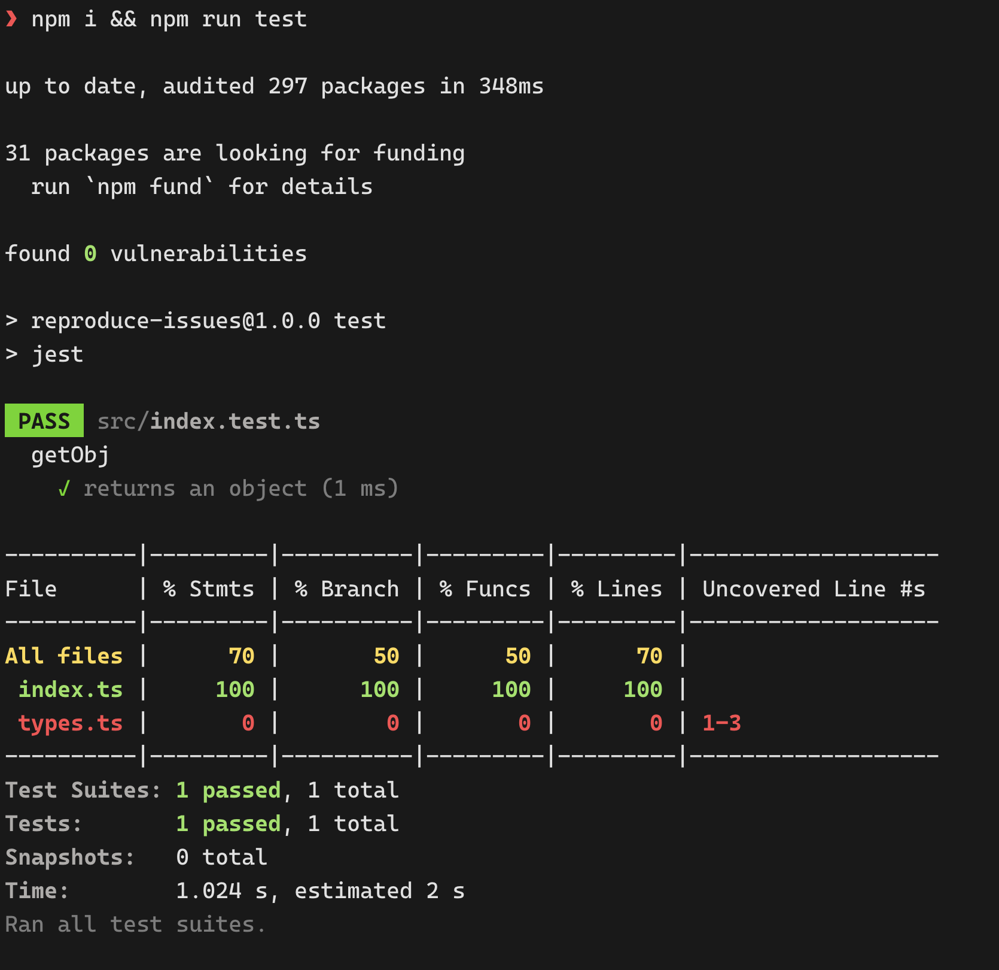

# reproduce issue

To reproduce the issue just run:

```
npm i
npm run test
```

## intended result

When calculating coverage, using coverage data from v8, it causes files which are excluded from the tests to be loaded without being transpiled. This leads to files containing only types to be treated as code missing coverage.


